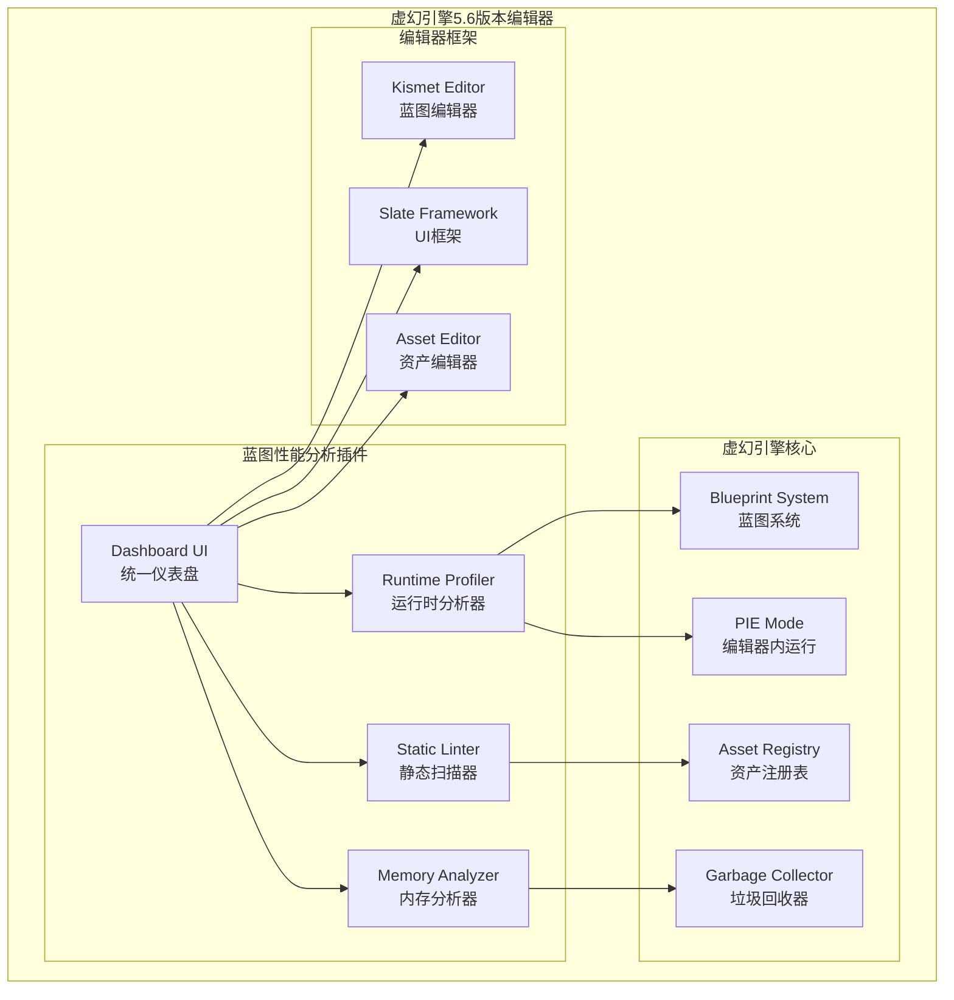

# 设计文档

## 概述

虚幻引擎蓝图性能分析插件是一个编辑器插件，旨在为蓝图开发者提供全面的性能分析和代码质量检查工具。该插件采用模块化架构，包含四个核心子系统：运行时分析器(Runtime Profiler)、静态扫描器(Static Linter)、内存分析器(Memory Analyzer)和统一仪表盘界面(Dashboard UI)。

插件的核心设计理念是"运行时诊断逻辑瓶颈，编辑器时扫描资产健康，全流程可视化交互"。通过结合实时性能监控、静态代码分析和内存引用分析，为开发者提供从开发到优化的完整工具链。

## 架构

### 整体架构



### 模块依赖关系

- **Runtime Profiler**: 依赖CoreUObject模块的FBlueprintCoreDelegates，Editor模块的PIE事件系统
- **Static Linter**: 依赖AssetRegistry模块，BlueprintGraph模块，Core模块的异步任务系统
- **Memory Analyzer**: 依赖CoreUObject模块的引用查找系统，AssetRegistry模块
- **Dashboard UI**: 依赖Slate模块，KismetEditor模块，AssetEditor管理器

## 组件和接口

### 1. Runtime Profiler (运行时分析器)

**职责**: 在PIE模式下实时监控蓝图节点执行性能，识别热点节点和Tick滥用。

**核心接口**:
```cpp
class BLUEPRINTPROFILER_API FRuntimeProfiler
{
public:
    // 录制控制
    void StartRecording();
    void StopRecording();
    void ResetData();
    
    // 数据访问
    TArray<FNodeExecutionData> GetExecutionData() const;
    TArray<FHotNodeInfo> GetHotNodes(float Threshold = 1000.0f) const;
    TArray<FTickAbuseInfo> GetTickAbuseActors() const;
    
    // 事件处理
    void OnScriptInstrumentation(const FFrame& Frame, const FBlueprintInstrumentationSignal& Signal);
    void OnPIEBegin();
    void OnPIEEnd();

private:
    bool bIsRecording;
    TMap<FWeakObjectPtr, FNodeExecutionStats> NodeStats;
    TArray<FExecutionFrame> ExecutionFrames;
};

struct FNodeExecutionData
{
    FWeakObjectPtr BlueprintObject;
    FString NodeName;
    FString BlueprintName;
    int32 TotalExecutions;
    float AverageExecutionsPerSecond;
    float TotalExecutionTime;
    float AverageExecutionTime;
};
```

**关键技术实现**:
- 使用`FBlueprintCoreDelegates::OnScriptInstrumentationSignal`钩子拦截节点执行
- 使用`FWeakObjectPtr`防止分析过程中对象销毁导致崩溃
- 使用`FEditorDelegates::BeginPIE`和`EndPIE`自动控制录制状态
- 实现高性能的数据收集，确保对游戏性能影响最小

### 2. Static Linter (静态扫描器)

**职责**: 扫描蓝图资产，检测代码质量问题，包括无效节点、孤岛节点和Cast滥用。

**核心接口**:
```cpp
class BLUEPRINTPROFILER_API FStaticLinter
{
public:
    // 扫描控制
    void ScanProject();
    void ScanFolder(const FString& FolderPath);
    void ScanBlueprints(const TArray<FAssetData>& Blueprints);
    
    // 结果访问
    TArray<FLintIssue> GetIssues() const;
    TArray<FLintIssue> GetIssuesByType(ELintIssueType Type) const;
    
    // 异步处理
    void StartAsyncScan(const TArray<FAssetData>& Assets, FOnScanComplete OnComplete);
    void CancelScan();

private:
    // 检测方法
    void DetectDeadNodes(UBlueprint* Blueprint, TArray<FLintIssue>& OutIssues);
    void DetectOrphanNodes(UBlueprint* Blueprint, TArray<FLintIssue>& OutIssues);
    void DetectCastAbuse(UBlueprint* Blueprint, TArray<FLintIssue>& OutIssues);
    
    TArray<FLintIssue> Issues;
    FAsyncTask<FScanTask>* CurrentScanTask;
};

enum class ELintIssueType : uint8
{
    DeadNode,      // 无效节点
    OrphanNode,    // 孤岛节点
    CastAbuse,     // Cast滥用
    TickAbuse      // Tick滥用
};

struct FLintIssue
{
    ELintIssueType Type;
    FString BlueprintPath;
    FString NodeName;
    FString Description;
    ESeverity Severity;
    FGuid NodeGuid;
};
```

**关键技术实现**:
- 使用`FAssetRegistryModule`遍历项目资产
- 通过`UBlueprint -> UEdGraph -> Nodes`数组遍历蓝图图表
- 使用`UK2Node`基类进行节点类型判断
- 使用`FScopedSlowTask`显示进度，`Async/ParallelFor`实现多线程扫描

### 3. Memory Analyzer (内存分析器)

**职责**: 分析蓝图的内存占用和引用关系，识别大资源引用和引用链问题。

**核心接口**:
```cpp
class BLUEPRINTPROFILER_API FMemoryAnalyzer
{
public:
    // 分析控制
    void AnalyzeBlueprint(UBlueprint* Blueprint);
    void AnalyzeBlueprintAsync(UBlueprint* Blueprint, FOnAnalysisComplete OnComplete);
    
    // 结果访问
    FMemoryAnalysisResult GetAnalysisResult(UBlueprint* Blueprint) const;
    TArray<FLargeResourceReference> GetLargeResourceReferences(float SizeThresholdMB = 10.0f) const;
    TArray<FReferenceChain> GetReferenceChains(UBlueprint* Blueprint) const;

private:
    // 分析方法
    void CalculateInclusiveSize(UBlueprint* Blueprint, FMemoryAnalysisResult& Result);
    void TraceReferenceChains(UObject* Object, TArray<FReferenceChain>& OutChains);
    void FindLargeResourceReferences(UBlueprint* Blueprint, TArray<FLargeResourceReference>& OutReferences);
    
    TMap<FWeakObjectPtr, FMemoryAnalysisResult> AnalysisResults;
};

struct FMemoryAnalysisResult
{
    float InclusiveSize;           // 包含大小(MB)
    int32 ReferenceDepth;          // 引用深度
    int32 TotalReferences;         // 总引用数
    TArray<FReferenceChain> ReferenceChains;
    TArray<FLargeResourceReference> LargeReferences;
};

struct FReferenceChain
{
    TArray<FWeakObjectPtr> Chain;
    float TotalSize;
    FString Description;
};
```

**关键技术实现**:
- 使用`FReferenceFinder`查找对象引用关系
- 使用`UObject::GetResourceSize`和`GetResourceSizeEx`计算资源大小
- 使用`AssetRegistry::GetDependencies`获取资产依赖关系
- 实现递归引用追踪，防止循环引用导致死循环

### 4. Dashboard UI (统一仪表盘)

**职责**: 提供统一的用户界面，展示所有分析结果，支持排序、过滤、跳转和导出功能。

**核心接口**:
```cpp
class BLUEPRINTPROFILER_API SBlueprintProfilerWidget : public SCompoundWidget
{
public:
    SLATE_BEGIN_ARGS(SBlueprintProfilerWidget) {}
    SLATE_END_ARGS()
    
    void Construct(const FArguments& InArgs);
    
    // 数据更新
    void RefreshData();
    void SetRuntimeData(const TArray<FNodeExecutionData>& Data);
    void SetLintIssues(const TArray<FLintIssue>& Issues);
    void SetMemoryData(const TArray<FMemoryAnalysisResult>& Data);
    
    // 用户交互
    FReply OnExportToCSV();
    FReply OnExportToJSON();
    void OnItemDoubleClicked(TSharedPtr<FProfilerDataItem> Item);

private:
    // UI组件
    TSharedPtr<SListView<TSharedPtr<FProfilerDataItem>>> DataListView;
    TSharedPtr<SSearchBox> SearchBox;
    TSharedPtr<SComboBox<TSharedPtr<FString>>> SortComboBox;
    TSharedPtr<SComboBox<TSharedPtr<FString>>> FilterComboBox;
    
    // 数据管理
    TArray<TSharedPtr<FProfilerDataItem>> AllDataItems;
    TArray<TSharedPtr<FProfilerDataItem>> FilteredDataItems;
    
    // 事件处理
    TSharedRef<ITableRow> OnGenerateRow(TSharedPtr<FProfilerDataItem> Item, const TSharedRef<STableViewBase>& OwnerTable);
    void OnSearchTextChanged(const FText& Text);
    void OnSortSelectionChanged(TSharedPtr<FString> Selection, ESelectInfo::Type SelectInfo);
    void OnFilterSelectionChanged(TSharedPtr<FString> Selection, ESelectInfo::Type SelectInfo);
};

struct FProfilerDataItem
{
    EProfilerDataType Type;        // 数据类型(Runtime/Lint/Memory)
    FString Name;                  // 节点/问题名称
    FString BlueprintName;         // 所属蓝图
    FString Category;              // 分类
    float Value;                   // 数值(执行次数/大小等)
    ESeverity Severity;            // 严重程度
    FWeakObjectPtr TargetObject;   // 目标对象
    FGuid NodeGuid;               // 节点GUID
};
```

**关键技术实现**:
- 使用Slate框架构建响应式UI
- 使用`SListView`和`STableViewBase`实现高性能数据列表
- 使用`FKismetEditorUtilities::BringKismetToFocusOnObject`实现节点跳转
- 使用`FAssetEditorManager`管理蓝图编辑器窗口

## 数据模型

### 执行数据模型
```cpp
// 节点执行统计
struct FNodeExecutionStats
{
    int32 ExecutionCount = 0;
    float TotalExecutionTime = 0.0f;
    float MinExecutionTime = FLT_MAX;
    float MaxExecutionTime = 0.0f;
    TArray<float> ExecutionTimes;
    
    float GetAverageExecutionTime() const;
    float GetExecutionsPerSecond(float RecordingDuration) const;
};

// 热点节点信息
struct FHotNodeInfo
{
    FWeakObjectPtr BlueprintObject;
    FGuid NodeGuid;
    FString NodeName;
    float ExecutionsPerSecond;
    float AverageExecutionTime;
    ESeverity Severity;
};
```

### 静态分析数据模型
```cpp
// 扫描任务配置
struct FScanConfiguration
{
    TArray<FString> IncludePaths;
    TArray<FString> ExcludePaths;
    TSet<ELintIssueType> EnabledChecks;
    bool bUseMultiThreading = true;
    int32 MaxConcurrentTasks = 4;
};

// 扫描进度信息
struct FScanProgress
{
    int32 TotalAssets = 0;
    int32 ProcessedAssets = 0;
    int32 IssuesFound = 0;
    FString CurrentAsset;
    float ProgressPercentage = 0.0f;
};
```

### 内存分析数据模型
```cpp
// 大资源引用
struct FLargeResourceReference
{
    FWeakObjectPtr ReferencingBlueprint;
    FWeakObjectPtr ReferencedAsset;
    FString VariableName;
    float AssetSize;
    FString AssetType;
    FString ReferencePath;
};

// 引用链节点
struct FReferenceNode
{
    FWeakObjectPtr Object;
    FString ObjectName;
    FString ObjectType;
    float ObjectSize;
    TArray<TSharedPtr<FReferenceNode>> Children;
};
```

## 正确性属性

*属性是一个特征或行为，应该在系统的所有有效执行中保持为真——本质上是关于系统应该做什么的正式声明。属性作为人类可读规范和机器可验证正确性保证之间的桥梁。*

基于需求分析和属性反思，以下是经过优化的正确性属性：

### 属性 1: 录制状态一致性
*对于任何*录制会话，录制状态的转换应该保持一致：开始录制后数据收集激活，停止录制后数据收集停止并保存结果，重置后所有数据被清空
**验证需求: 需求 1.1, 1.4, 6.1, 6.2, 6.3**

### 属性 2: 节点执行数据完整性
*对于任何*被执行的蓝图节点，Runtime_Profiler应该准确记录其执行次数和耗时，并根据执行频率正确标记热点节点
**验证需求: 需求 1.2, 1.3**

### 属性 3: Tick滥用检测准确性
*对于任何*包含Event Tick节点的蓝图，当其逻辑复杂度超过阈值时，应该被正确标记为Tick滥用
**验证需求: 需求 1.5**

### 属性 4: 静态扫描覆盖完整性
*对于任何*指定扫描范围内的Blueprint_Asset，Static_Linter应该遍历所有资产并生成包含所有发现问题的完整报告
**验证需求: 需求 2.1, 2.5**

### 属性 5: 无效节点检测准确性
*对于任何*蓝图中未被引用的变量或函数，Static_Linter应该将其正确标记为无效节点
**验证需求: 需求 2.2**

### 属性 6: 孤岛节点检测准确性
*对于任何*未连接执行引脚的纯计算节点，Static_Linter应该将其正确标记为孤岛节点
**验证需求: 需求 2.3**

### 属性 7: Cast滥用检测准确性
*对于任何*在循环或Tick上下文中的硬引用Cast操作，Static_Linter应该将其正确标记为Cast滥用
**验证需求: 需求 2.4**

### 属性 8: 内存分析计算准确性
*对于任何*选定的蓝图，Memory_Analyzer应该准确计算其包含大小、追踪所有硬引用链并计算正确的引用深度
**验证需求: 需求 3.1, 3.2**

### 属性 9: 大资源警报检测准确性
*对于任何*引用超过指定大小阈值资源的蓝图变量，Memory_Analyzer应该将其正确标记为大资源警报并准确定位引用变量
**验证需求: 需求 3.3, 3.5**

### 属性 10: 可视化数据完整性
*对于任何*完成的内存分析结果，应该包含构建引用关系可视化展示所需的完整数据结构
**验证需求: 需求 3.4**

### 属性 11: 数据展示格式一致性
*对于任何*分析结果数据，Dashboard_UI应该按统一格式展示节点名、所属蓝图、计数和严重程度等必需信息
**验证需求: 需求 4.2**

### 属性 12: 排序和过滤功能正确性
*对于任何*分析结果数据集，Dashboard_UI的排序功能应该按指定维度正确排序，搜索功能应该实时过滤出匹配的结果
**验证需求: 需求 4.3, 4.4**

### 属性 13: 节点跳转功能完整性
*对于任何*有效的分析结果项，双击后应该正确打开对应蓝图编辑器、聚焦到目标节点并提供视觉高亮反馈
**验证需求: 需求 4.5, 8.1, 8.2, 8.3, 8.5**

### 属性 14: 数据导出往返一致性
*对于任何*分析结果数据，导出为CSV或JSON格式后再重新读取，应该保持数据的完整性和一致性
**验证需求: 需求 5.2, 5.3, 5.5**

### 属性 15: 导出完成反馈准确性
*对于任何*导出操作，完成后应该提供准确的文件保存位置确认信息
**验证需求: 需求 5.4**

### 属性 16: PIE模式自动状态管理
*对于任何*PIE模式的开始和结束事件，Runtime_Profiler应该根据用户设置正确地自动开始或停止录制
**验证需求: 需求 6.4, 6.5**

### 属性 17: 批量处理进度反馈准确性
*对于任何*批量处理操作，系统应该实时提供准确的处理进度和剩余时间估算，完成后提供正确的处理摘要
**验证需求: 需求 7.2, 7.5**

### 属性 18: 批量操作取消安全性
*对于任何*进行中的批量操作，用户取消后系统应该安全停止处理并保存已完成的部分结果
**验证需求: 需求 7.4**

## 错误处理

### 运行时错误处理
- **对象生命周期管理**: 使用FWeakObjectPtr防止分析过程中对象销毁导致的崩溃
- **性能保护**: 实现执行时间监控，防止分析代码本身影响游戏性能
- **内存保护**: 限制数据收集的内存使用，防止内存溢出
- **异常恢复**: 在节点执行钩子中捕获异常，确保分析失败不影响游戏运行

### 静态分析错误处理
- **资产加载失败**: 优雅处理无法加载的蓝图资产，记录错误但继续处理其他资产
- **图表解析错误**: 处理损坏或不完整的蓝图图表，提供详细的错误信息
- **并发安全**: 确保多线程扫描时的数据一致性和线程安全
- **取消操作**: 支持用户取消长时间运行的扫描操作

### 内存分析错误处理
- **循环引用检测**: 防止引用链追踪时的无限递归
- **大数据集处理**: 对于引用关系复杂的大型项目，实现分页和增量分析
- **资源计算失败**: 处理无法计算大小的特殊资源类型
- **引用失效**: 处理分析过程中引用对象被销毁的情况

### UI错误处理
- **跳转失败**: 当目标节点不存在或蓝图无法打开时，显示友好的错误提示
- **数据展示异常**: 处理异常数据格式，防止UI崩溃
- **导出失败**: 处理文件系统权限问题和磁盘空间不足
- **搜索性能**: 对于大数据集的搜索和过滤操作进行性能优化

## 测试策略

### 双重测试方法

本项目采用单元测试和基于属性的测试相结合的方法：

**单元测试**专注于：
- 特定的示例和边缘情况
- 组件间的集成点
- 错误条件和异常处理
- UI交互的具体场景

**基于属性的测试**专注于：
- 验证跨所有输入的通用属性
- 通过随机化实现全面的输入覆盖
- 系统行为的正确性保证

### 基于属性的测试配置

- **测试框架**: 使用Unreal Engine的自动化测试框架结合Hypothesis-style属性测试
- **迭代次数**: 每个属性测试最少运行100次迭代（由于随机化需要）
- **测试标记**: 每个属性测试必须引用其设计文档属性
- **标记格式**: **Feature: unreal-blueprint-profiler, Property {number}: {property_text}**
- **实现要求**: 每个正确性属性必须由单个基于属性的测试实现

### 测试数据生成策略

**蓝图数据生成**:
- 生成具有不同复杂度的随机蓝图结构
- 创建各种节点类型和连接模式
- 模拟不同的引用关系和资源大小

**执行数据生成**:
- 模拟不同频率和耗时的节点执行
- 生成各种PIE会话场景
- 创建不同的录制状态转换序列

**UI测试数据**:
- 生成大量分析结果数据用于排序和过滤测试
- 创建各种搜索查询和用户交互序列
- 模拟不同的导出场景和数据格式

### 性能测试

- **运行时性能**: 确保数据收集代码对游戏性能影响最小（<1%开销）
- **扫描性能**: 验证大型项目的扫描时间在可接受范围内
- **UI响应性**: 确保大数据集下的UI操作保持流畅
- **内存使用**: 监控分析过程中的内存消耗，防止内存泄漏

### 集成测试

- **编辑器集成**: 测试与虚幻编辑器各组件的集成
- **蓝图编辑器交互**: 验证节点跳转和高亮功能
- **PIE模式集成**: 测试与Play In Editor模式的集成
- **资产系统集成**: 验证与资产注册表和资产管理器的交互